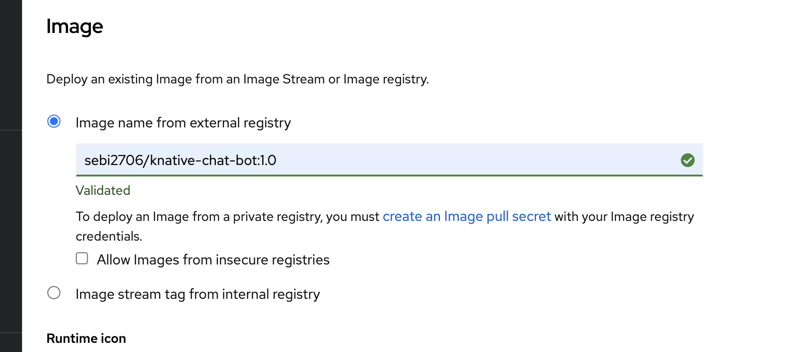
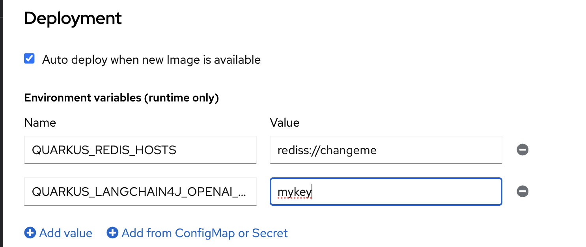

# knative-chat-bot with Redis Memory Store

This repository is to demonstrate the usage of `quarkus-langchain4j-memory-store-redis`.

We know that LLMs are stateless, Langchain4j comes with the concept of a chat memory store to maintain the context during a conversation. 

By default, a default in-memory store is used which is perfectly fine for most uses cases but keep in mind that is not completely resilient. Imagine you are running this app inside a pod and/or a container : 

* The pod could be restarted / rescheduled
* If you have high traffic you RAM will quickly increase
* If you were planning a serverless approach (with a scale to 0), the memory context will be reset at each request

It's for this last use case that we will introduce `quarkus-langchain4j-memory-store-redis`, it will keep the memory inside a Redis server so even if the app/pod/container is restarted it will be able to retrieve the correct contexts. 

# Pre-requisites

## K8s cluster with the `knative` operator installed

You will need a k8s cluster with the `knative` operator installed. One of the easiest way and having also a public route to test your bot is to deploy it on the `Openshift Developer Sandbox`, you can create an account for free, a lot of operators are installed by default including Knative , check it out [here](https://developers.redhat.com/developer-sandbox).

## Redis cluster

You will also need a Redis cluster with a public accessible host. 
Aiven has a free-plan which includes Redis, MySQL and PostgreSQL, use [this link](go.aiven/sebi-signup) to create an account for free and it will also give a lot of credits to try out the other services (Kafka, Clickhouse, OpenSearch). 

# Deploying the app

There basically 3 differents way of deploying this app, choose the one you like the best.

## Using `kn` CLI 

This is probably the easiest one, make sure you have `kn`, the Knatice CLI, installed on your machine. Makes also sure to have KUBECONFIG set.

Replace the 2 placeholders for the `--env` parameters and run : 

```bash

kn service create knative-chat-bot --env QUARKUS_REDIS_HOSTS=rediss://<redis_user>:<redis_password>@<redis_host>:<redis_port> --env QUARKUS_LANGCHAIN4J_OPENAI_API_KEY=<openai_key> --image sebi2706/knative-chat-bot:1.0 --scale-window 10s

```

## Using `kubectl` and the manifest

Update `knative-service.yml` to set the correct environment variables and then run : 

```
kubectl apply -f knative-service.yml

```

## Using Openshift's developer's perspective 

Another super convenient way of deploying your knative service, is to use the Openshift's developer's perspective : 

Go to `+Add` and choose `Container images` , then all you have to do is pass the container image `sebi2706/knative-chat-bot:1.0` , by default it will deployed as a knative service. 



Don't forget to set the environment variables, you can find it at the bottom in the `deployment` options : 

* QUARKUS_REDIS_HOSTS
* QUARKUS_LANGCHAIN4J_OPENAI_API_KEY




# Testing the app

Once that you're application is deployed, get your knative service route url and run (don't forget to change the url): 

```bash

curl -X POST  -H 'Content-Type: text/plain' -d 'Hello ! My name is Sebi !'  https://knative-chat-bot-scm-blanc-dev.apps.sandbox-m2.ll9k.p1.openshiftapps.com/chat/1

```

You should get a response, then wait at least 10 seconds so that the pod scales back to 0. 

Now you can run the second request : 

```bash

curl -X POST  -H 'Content-Type: text/plain' -d 'What is my name ?'  https://knative-chat-bot-scm-blanc-dev.apps.sandbox-m2.ll9k.p1.openshiftapps.com/chat/5

```

The service should reply that it knows who you are ! This is the proof that your serverless service can use a persistent memory context ! 


